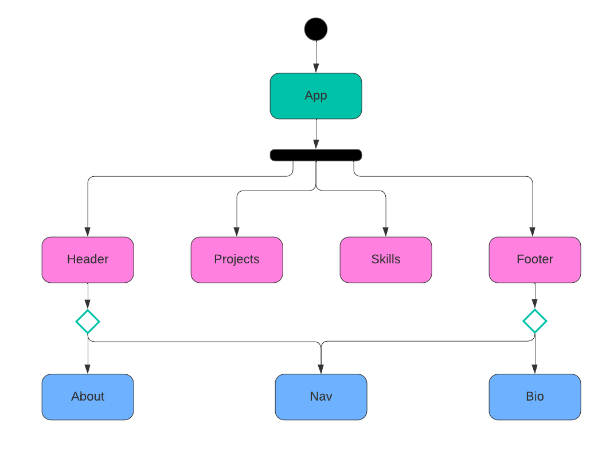

# Amanda's Portfolio

Hello there! I'm a Full Stack Web Developer who excels in handling intricate layouts and crafting web pages that prioritize user-friendliness and delight.

[amitzian.dev](https://amitzian.dev/)

## Technologies used

## Attributions

-   Pink svg at the top of the page provided by loading.io - https://loading.io/icon/
-   Skills' icons provided by Devicon - https://devicon.dev/

## Future features

-   Enhance project descriptions.

## App diagram

